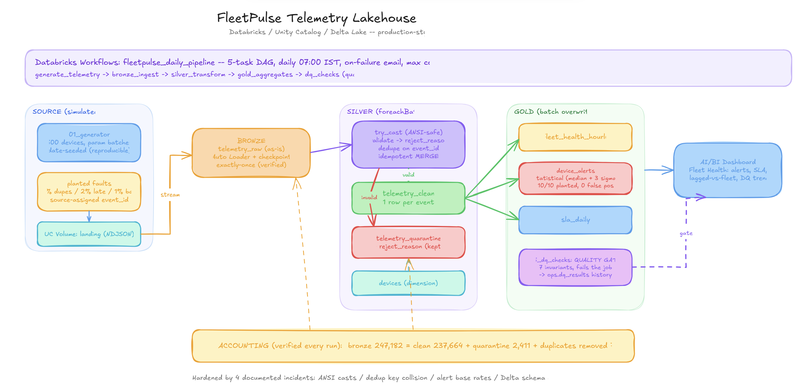
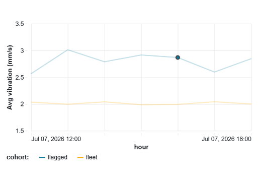
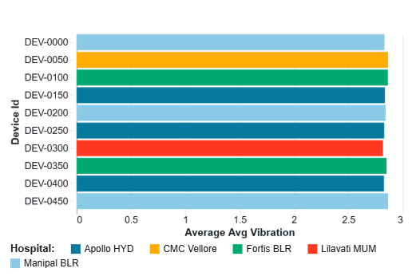
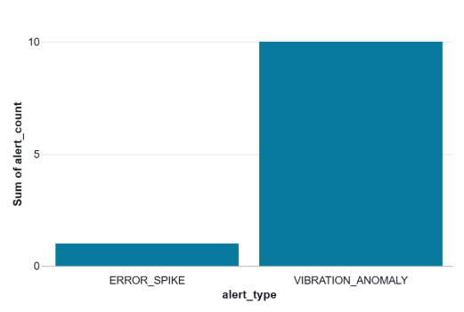
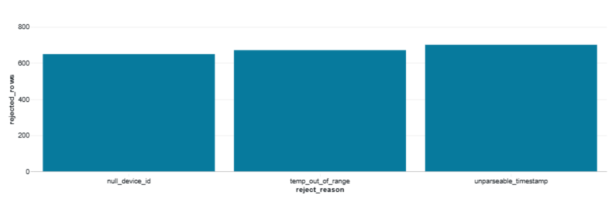
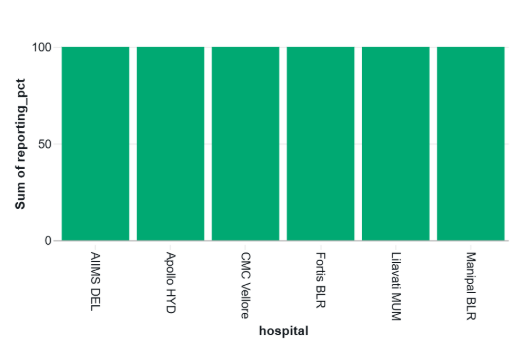
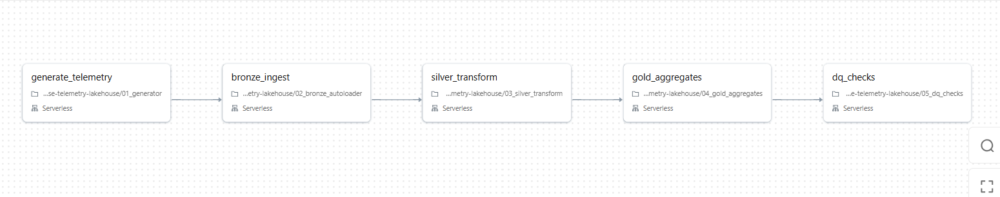

# FleetPulse — Telemetry Lakehouse on Databricks

A production-style medallion lakehouse that ingests noisy medical-device telemetry as a stream, quarantines bad data with full auditability, detects failing devices statistically, and runs itself daily with an automated data-quality gate.

**Stack:** Databricks (serverless) · Unity Catalog · Delta Lake · PySpark Structured Streaming · Auto Loader · Databricks Workflows · AI/BI Dashboards · GitHub



---

## Results at a glance

| Metric | Value |
|---|---|
| Events processed (bronze) | **247,182** |
| Row accounting | bronze 247,182 = clean 237,664 + quarantine 2,411 + duplicates removed 7,107 — **exact, verified every run** |
| Exactly-once ingestion | Verified: full re-run of ingestion produced **zero** new rows (checkpointed Auto Loader) |
| Anomaly detection | **10/10** secretly-degraded devices identified, **0 false positives** (median + 3σ, no hand-tuned thresholds) |
| Duplicate handling | 2.88% duplicate rate detected and removed on source-assigned `event_id` |
| Data-quality gate | 7 automated invariants run after every pipeline execution; failures fail the job |
| Orchestration | 5-task Databricks Workflows DAG, scheduled daily, on-failure notifications — end-to-end run in ~3 min |

<p>
  
  
</p>
<p>
  
  
  
</p>

*Fleet Health dashboard (AI/BI): the flagged cohort sits visibly above a flat fleet baseline; alerts stay rare by design; every quarantined row is labeled with its reject reason.*

---

## The problem

A medical-imaging manufacturer ("MedScan Systems", simulated) operates ~500 MRI/CT machines across Indian hospitals, each emitting telemetry every 30 seconds. Failures are discovered only after machines go down; raw logs arrive duplicated, late, and corrupted over hospital networks; leadership has no fleet-level view of machine health or SLA.

FleetPulse turns that raw stream into trustworthy, dashboard-ready answers with one governing principle: **every row that enters the system is accounted for** — it lands in clean data, lands in quarantine with a reason, or is a provable duplicate. Nothing disappears silently.

The telemetry is produced by a purpose-built simulator — deliberately. It plants faults at known rates (3% duplicates, 2% late events, 1% malformed records, 10 devices with slowly rising vibration), so the pipeline's detection can be *proven* against ground truth rather than assumed. Seeding is date-based: every day's data is different, yet any day can be regenerated exactly for debugging.

## Architecture

```
01_generator ──> UC Volume (landing, NDJSON)
                     │  Auto Loader (streaming, availableNow, checkpointed)
                     ▼
              BRONZE  telemetry_raw          everything as-is + ingest metadata
                     │  foreachBatch: try_cast → validate → quarantine → dedupe → MERGE
                     ▼
              SILVER  telemetry_clean        typed, valid, exactly one row per event
                      telemetry_quarantine   every rejected row + reject_reason
                      devices                dimension (registry)
                     │  batch overwrite (gold is derived → rebuild is idempotent)
                     ▼
              GOLD    fleet_health_hourly · device_alerts · sla_daily
                     │
                     ▼
              05_dq_checks (quality gate) ──> ops.dq_results (quality history)
                     │
                     ▼
              AI/BI Dashboard: Fleet Health
```

Layer contracts: **bronze** may contain garbage, duplicates, and wrong types — but never loses what arrived, so silver can always be rebuilt. **Silver** guarantees types, validity, and uniqueness per real-world event. **Gold** is business-level and safe to point a dashboard at. Full design rationale for every decision: [ENGINEERING_GUIDE.md](ENGINEERING_GUIDE.md).

## What makes this more than a tutorial project

**Fault injection with verification.** Faults go in at known rates; quarantine and dedup counts must reconcile against them. The audit query (below) runs as an automated check after every pipeline execution.

```sql
SELECT b.n AS bronze, c.n AS clean, q.n AS quarantine,
       b.n - c.n - q.n AS removed_as_duplicates
FROM (SELECT COUNT(*) n FROM fleetpulse.bronze.telemetry_raw)  b,
     (SELECT COUNT(*) n FROM fleetpulse.silver.telemetry_clean) c,
     (SELECT COUNT(*) n FROM fleetpulse.silver.telemetry_quarantine) q;
```

**Statistical alerting, not magic thresholds.** A device alerts when its average vibration exceeds the fleet median + 3σ. The 10 planted degrading devices were recovered exactly — the pipeline was never told which they were.

**Idempotency where it matters.** Ingestion is exactly-once via streaming checkpoints; silver writes are idempotent via `MERGE ... WHEN NOT MATCHED` on a source-assigned event UUID; gold rebuilds are idempotent via overwrite. The one non-idempotent write (quarantine append) is a documented, deliberate trade-off.



**A quality gate that can say no.** `05_dq_checks` asserts 7 invariants — row accounting, duplicate-ratio bounds, key uniqueness, null contracts, referential integrity, known quarantine reasons, and alert base-rate sanity — persists results to `ops.dq_results`, and raises on failure so the scheduled job fails visibly instead of shipping bad data to the dashboard.

## Incident log (kept on purpose)

Four real failures occurred during the build. Each was diagnosed, fixed, and converted into a regression guard. Full write-ups in the [engineering guide](ENGINEERING_GUIDE.md); summaries:

1. **ANSI-mode cast crash.** Planted `"not-a-timestamp"` killed the first silver run — serverless runs ANSI SQL where invalid casts throw. Fixed with `try_cast`/`try_to_timestamp` so semantic garbage becomes quarantine rows, not exceptions.
2. **Dedup key destroyed ~2,000 real rows.** Deduping on `(device_id, event_ts)` collided distinct same-second readings (a birthday problem). Caught because layer-by-layer row accounting stopped balancing; fixed with source-assigned `event_id` UUIDs. Post-fix: accounting balances to the row.
3. **Alert rule fired for 98% of the fleet.** A `min(helium) < threshold` rule ignored the base-rate behavior of a minimum over ~400 samples. Redesigned as independent statistical rules; the DQ gate now permanently asserts alerts stay rare.
4. **Delta schema enforcement on overwrite.** A gold schema change was refused by Delta's schema protection — resolved with explicit `overwriteSchema`, adopted as layer policy (allowed for derived gold, not for silver).

## Repository structure

```
01_generator            telemetry simulator: registry + NDJSON batches, fault injection, date-seeded
02_bronze_autoloader    Auto Loader streaming ingestion, rescue mode, exactly-once
03_silver_transform     foreachBatch: cast → validate → quarantine → dedupe → MERGE
04_gold_aggregates      hourly health mart, statistical device alerts, SLA
05_dq_checks            7-invariant quality gate + ops.dq_results history
dashboards/             AI/BI dashboard definition (.lvdash.json)
docs/                   architecture diagram (png + editable .excalidraw), screenshots
ENGINEERING_GUIDE.md    full design rationale, incident write-ups, glossary
```

## Running it

Requires only [Databricks Free Edition](https://www.databricks.com/learn/free-edition) (no cloud account, no credit card).

1. Clone the repo into a Databricks Git folder; create catalog `fleetpulse` with schemas `bronze/silver/gold/ops/raw` and volumes `raw.landing`, `raw.checkpoints`.
2. Run notebooks 01 → 05 in order (01 accepts an `n_batches` parameter; default 2, use 10 for an initial load).
3. Or create a 5-task Workflows job chaining them — task parameters and schedule described in the engineering guide. Re-running any stage is safe by design.

## Production differences

On Free Edition, UC volumes stand in for ADLS Gen2/S3 (same code, different path), Auto Loader runs in directory-listing rather than file-notification mode, and CI/CD via Databricks Asset Bundles plus secret management are out of scope. Each is a config change, not a redesign.

## Roadmap (in priority order)

1. **Unit tests for transformation logic** — extract validation/dedup into a testable module; pytest with planted-fault DataFrames asserting quarantine routing and dedup behavior.
2. **Time-spread simulation** — 48-hour event-time distribution with time-based degradation, turning the flagged-vs-fleet chart into a true degradation curve.
3. **SCD Type 2 on the devices dimension** — track firmware/location changes over time so events join to device attributes as of event time.
4. **Idempotent quarantine writes** — MERGE on a content hash, closing the one documented non-idempotent write.
5. **Asset Bundles CI/CD** — bundle-defined jobs deployed via GitHub Actions on merge to main.
6. **Performance study** — skew and small-files experiments, meaningful only after scaling the generator to tens of millions of rows.

---

*Built by Harshit Verma — Senior Data Engineer · harshitverma1777@gmail.com. The full decision-by-decision walkthrough, written for engineers joining the project, is in [ENGINEERING_GUIDE.md](ENGINEERING_GUIDE.md).*
